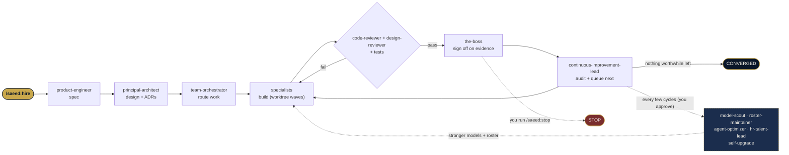

<div align="center">

# SAEED · سعيد

### Self-Advancing Elite Engineering Directorate

**A complete software engineering team you install into [Claude Code](https://docs.claude.com/en/docs/claude-code/overview) —
53 specialist AI engineers that design, build, test, secure, and document your project, then keep improving it on their own.**

<p>
  
  
  
  
  
</p>

**[📖 What is SAEED? (visual page, EN + العربية)](docs/what-is-saeed.html)** ·
**[⚡ Cheat sheet](docs/CHEATSHEET.md)** ·
Built by [Saeed AlMansoori](https://almansoori.uk)

**A product of NABAD Computer Solutions L.L.C. · نبض لحلول الكمبيوتر ذ.م.م**

</div>

---

## What this is

You hand SAEED a goal with one command — `/saeed:hire` — and it runs the whole lifecycle:
plans the architecture, splits the work across the right specialists, writes the code, reviews it,
tests it, hardens security, and documents everything. Then it **audits its own work and keeps
improving** until there's nothing worthwhile left to do, or you tell it to stop.

It does a few things most agent packs don't:

- 👔 **A micro-managing boss** (`the-boss`) that assigns work, demands evidence, and rejects anything half-done.
- ♻️ **A continuous-improvement loop** with an honest **convergence** stop — it won't invent busywork.
- 🧬 **Self-upgrade**: `model-scout` moves the team onto stronger models as they ship; `roster-maintainer` adds/retires agents; `agent-optimizer` sharpens their prompts.
- 🎨 **Absorbed design taste**: an elite **Design Excellence** canon (distilled from `impeccable`, `gpt-taste`, `emil-design-eng`, and more) is baked into every UI agent and enforced by a dedicated `design-reviewer` gate — so the UI never looks AI-generated, without you having to ask.
- 🧩 **Absorbed delivery discipline**: an **Orchestration Protocol** (distilled from the `claude-sdlc-kit`) runs parallel work in worktree-isolated waves off a shared ticket queue, keeps integration a separate gated run, and does adversarial parallel-browser QA.
- 📱 **Web + native mobile**: web (React/Next), plus dedicated **native iOS** (Swift/SwiftUI) and **native Android** (Kotlin/Compose) engineers — not just cross-platform.
- 🖥️ **Owns the metal**: dedicated **networking** and **AI-systems** engineers (Docker, NVIDIA DGX Spark, GPU/CUDA, vLLM/Ollama) for the air-gapped stack.
- 🌐 **Bilingual by design**: Arabic/English + RTL correctness is baked into every user-facing agent.

## 💸 What it saves (UAE, AED)

To do what SAEED does, a company hires a team. At 2026 UAE mid-market salaries:

```text
Human team — fully loaded   ████████████████████████████████████████  ≈ AED 5,700,000 / yr
Human team — base salaries  ██████████████████████████████            ≈ AED 4,224,000 / yr
SAEED (Claude Max 20x)      ▏                                         ≈ AED     8,820 / yr
                            └───────────────────────────────────────  ~480–650× cheaper (≈0.15% of payroll)
```

That last bar really is a hairline — that's the point. Full breakdown, both languages, and nicer
charts in **[docs/what-is-saeed.html](docs/what-is-saeed.html)**.
*(Illustrative mid-market figures; SAEED augments you rather than being a literal headcount swap.)*

## 🔄 How the work flows



## 🚀 Install

Requires the Claude Code CLI.

```bash
# 1. Register this repo as a plugin marketplace (local path, or owner/repo once pushed)
/plugin marketplace add S-AlMansoori/S.A.E.E.D
#   (or from a local clone:)  /plugin marketplace add /path/to/S.A.E.E.D

# 2. Install the plugin
/plugin install saeed@saeed-marketplace
```

Restart the session, then run `/agents` to see all 53.

## 🎛️ Commands

| Command | What it does |
|---|---|
| `/saeed:hire <goal>` | Take a project from zero to done, then keep improving it. **Start here.** |
| `/saeed:improve` | Run improvement passes (audit → fix → verify → repeat). The self-improvement button. |
| `/saeed:status` | A blunt, no-spin status report from the Boss. |
| `/saeed:upgrade` | The team upgrades itself: better models + add/retire its own agents. |
| `/saeed:stop` | Halt the autonomous loop. |
| `/saeed:help` | Show the cheat sheet. |

Or just **ask in plain English or Arabic** — *"use the rag-architect to design retrieval for this
corpus"* — and the right specialist is picked automatically.

## 🤖 Truly autonomous (unattended) mode

Claude Code subagents run inside a session — they don't self-trigger 24/7. For genuine hands-off
operation, point the runner at a repo. It runs `/saeed:improve` every cycle until the team writes
`.saeed/CONVERGED`, you drop a `.saeed/STOP` file, or it hits the cap:

```bash
scripts/saeed-loop.sh /path/to/your/repo 50 0
#                       repo               max  sleep(sec)
```

Wire it to `cron` or CI for scheduled improvement. ⚠️ It edits files unattended — only run it on a
repo under git.

### The `.saeed/` folder (the team's shared memory, created in your project)

| File | Holds |
|---|---|
| `queue.md` | Backlog: each item's owner, acceptance criteria, status. |
| `state.json` | Machine-readable ledger + cycle count. |
| `retro.md` | Retrospectives and learnings. |
| `models.md` | Which agent runs on which model (+ history). |
| `CONVERGED` | Appears when nothing worthwhile is left to improve (with reasons). |
| `STOP` | You create this to halt. Delete it to resume. |

## 👥 The roster (53 agents)

Heavy-reasoning roles run on the top tier (Opus); implementers run on the mid tier (Sonnet).
`model-scout` re-tiers the fleet when better models become available.

### Governance & Meta
| Agent | Model | Role |
|---|---|---|
| `the-boss` | opus | Enforces accountability — assigns, chases, signs off on evidence |
| `team-orchestrator` | opus | Decomposes goals and routes work to the right specialist |
| `hr-talent-lead` | opus | HR/staffing — detects capability gaps, commissions new agents |
| `roster-maintainer` | opus | Adds, retires, or reshapes the team's own agents |
| `model-scout` | sonnet | Keeps the team on the best available models |
| `continuous-improvement-lead` | opus | Drives the improvement loop; decides convergence |
| `agent-optimizer` | opus | Improves the agents' own prompts |
| `prompt-engineer` | opus | Prompt craft for users + the inter-agent communication layer |
| `self-eval-critic` | opus | Independently verifies gains; runs retros (read-only) |

### Architecture & Product
| Agent | Model | Role |
|---|---|---|
| `principal-architect` | opus | System design, tech choices, and ADRs |
| `product-engineer` | sonnet | Turns ideas/BRDs into buildable specs |

### Frontend & Mobile
| Agent | Model | Role |
|---|---|---|
| `frontend-engineer` | sonnet | Builds and modifies web UI (React/Next) |
| `react-native-engineer` | sonnet | Cross-platform mobile (Expo/React Native) |
| `ios-engineer` | sonnet | Native iOS (Swift/SwiftUI) |
| `android-engineer` | sonnet | Native Android (Kotlin/Jetpack Compose) |
| `frontend-performance-engineer` | sonnet | Diagnoses and fixes frontend performance |
| `accessibility-specialist` | sonnet | Audits and fixes accessibility (WCAG) |
| `pwa-offline-engineer` | sonnet | PWA and offline-first work |

### Design
| Agent | Model | Role |
|---|---|---|
| `product-designer` | sonnet | UX flows, wireframes, interaction design |
| `ui-visual-designer` | opus | Visual and brand design (navy/gold) |
| `design-systems-engineer` | sonnet | Builds and maintains the design system |
| `design-reviewer` | opus | Design-excellence gate for user-facing diffs (read-only) |
| `ux-researcher` | sonnet | Plans and analyzes user research |

### Backend
| Agent | Model | Role |
|---|---|---|
| `backend-engineer` | sonnet | Builds server-side logic |
| `api-designer` | sonnet | Designs API contracts |
| `realtime-engineer` | sonnet | Realtime and event-driven features |
| `edge-serverless-engineer` | sonnet | Edge/serverless (Cloudflare Workers/Pages) |

### Data & Databases
| Agent | Model | Role |
|---|---|---|
| `database-architect` | sonnet | Data modeling, schema, RLS, migrations |
| `query-optimization-engineer` | sonnet | Diagnoses and fixes slow queries |
| `vector-search-engineer` | sonnet | Embeddings + vector search (bilingual) |
| `data-engineer` | sonnet | Pipelines, ETL, OCR digitization |

### AI / ML
| Agent | Model | Role |
|---|---|---|
| `llm-engineer` | opus | LLM app work (prompts, tools, evals) |
| `rag-architect` | opus | Designs and improves RAG end-to-end |
| `ml-engineer` | sonnet | Model selection, fine-tuning, evaluation |
| `mlops-engineer` | sonnet | Serves/operates models (vLLM on the DGX) |
| `nlp-bilingual-specialist` | sonnet | Arabic/English NLP correctness |

### Security
| Agent | Model | Role |
|---|---|---|
| `security-architect` | opus | Threat modeling and authZ/ABAC design |
| `appsec-engineer` | sonnet | Finds and fixes app vulnerabilities (OWASP) |
| `devsecops-engineer` | sonnet | Secures the pipeline and runtime |
| `security-pentester` | sonnet | Tests your OWN systems (defensive only) |

### Infrastructure & Ops
| Agent | Model | Role |
|---|---|---|
| `devops-platform-engineer` | sonnet | CI/CD, the developer platform, gated integration |
| `cloud-infra-engineer` | sonnet | Infrastructure as code, provisioning |
| `network-engineer` | sonnet | Networking, segmentation, DNS/TLS, air-gap isolation |
| `ai-systems-engineer` | sonnet | Docker + NVIDIA DGX Spark + GPU/CUDA + AI tooling |
| `sre-observability-engineer` | sonnet | Reliability, SLOs, monitoring, incidents |

### Quality
| Agent | Model | Role |
|---|---|---|
| `qa-automation-engineer` | sonnet | Writes automated tests (unit/integration/E2E) |
| `test-architect` | sonnet | Sets test strategy and coverage plan |
| `code-reviewer` | sonnet | Reviews diffs before they're accepted (read-only) |

### Specialists
| Agent | Model | Role |
|---|---|---|
| `python-engineer` | sonnet | Python (FastAPI, async, tooling) |
| `typescript-specialist` | sonnet | Advanced TypeScript / precise types |
| `technical-writer` | sonnet | Documentation (bilingual) |
| `i18n-localization-engineer` | sonnet | RTL layout and locale formatting |
| `compliance-privacy-engineer` | sonnet | PII, privacy, retention (UAE-aware) |

## 🛡️ Safety & guardrails

This team edits code and, in the loop, does so repeatedly. It's built with rails, but **you own the
blast radius**:

- **Version-control everything** and only run the loop on a clean git repo so you can review and revert.
- **Self-modification needs approval by default** — `/saeed:upgrade` proposes model/roster changes and waits for you.
- **The team never disables its own review/test/security gates**, and `self-eval-critic` independently checks that gains are real.
- **Security is defensive only.** `security-pentester` tests systems *you own*; the security agents won't produce malware or attack third parties.
- **Convergence is a feature** — the loop is designed to *stop* when returns diminish.

Nothing here is legal advice; `compliance-privacy-engineer` flags issues, but consult qualified
counsel for legal questions.

## 🧩 Customize

- Change the tagline in `.claude-plugin/plugin.json`.
- Add or edit agents in `agents/` — or ask `roster-maintainer` to do it.
- Adjust model tiers per agent's `model:` frontmatter — or let `model-scout` manage it.

## 🤝 Contributing

PRs welcome — new specialists, better prompts, fixes. See [CONTRIBUTING.md](CONTRIBUTING.md).

## 📄 License

MIT © 2026 Saeed AlMansoori — a product of **NABAD Computer Solutions L.L.C.** (نبض لحلول الكمبيوتر ذ.م.م).
Share it freely with friends, family, and the community.
